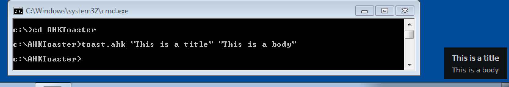

# AHKToaster

AHKToaster is a simple script that can be used to show toast notifications on ie. Windows 7 that doesn't support toast notifications by default.

## Usage
```
toaster.ahk "This is a title" "This is a body"
```



## TODO
- [ ] compile this to .exe

## Credits
[Adnan Topal](https://github.com/adnantopal) for [SNotify](https://github.com/adnantopal/snotify) script.

[gwarble](http://gwarble.com/ahk/Notify/) for [Notify](http://gwarble.com/ahk/Notify/) script.